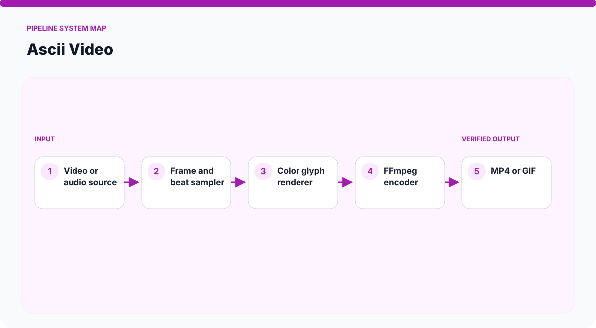
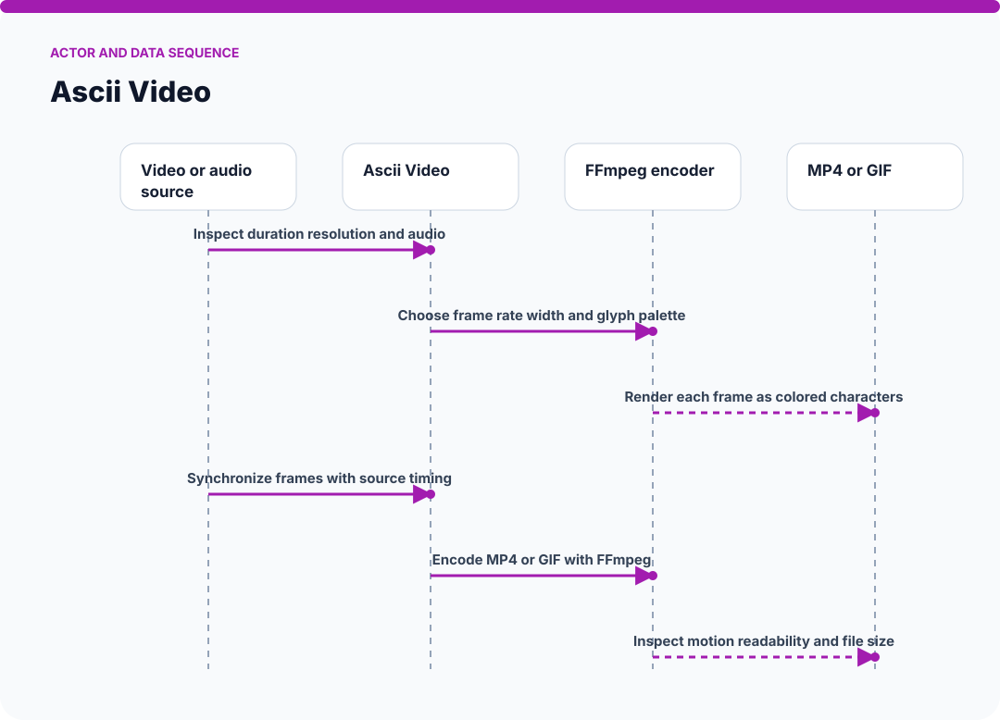
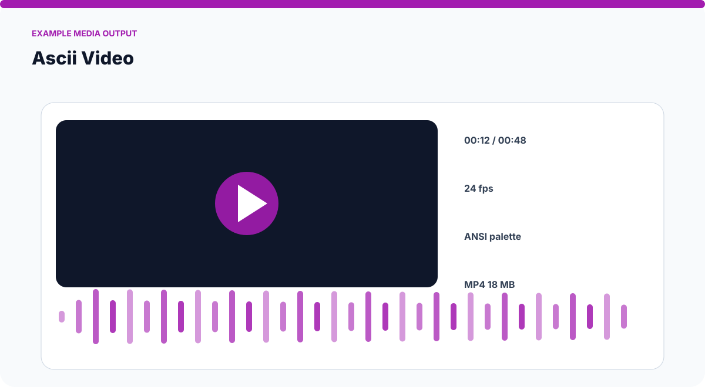
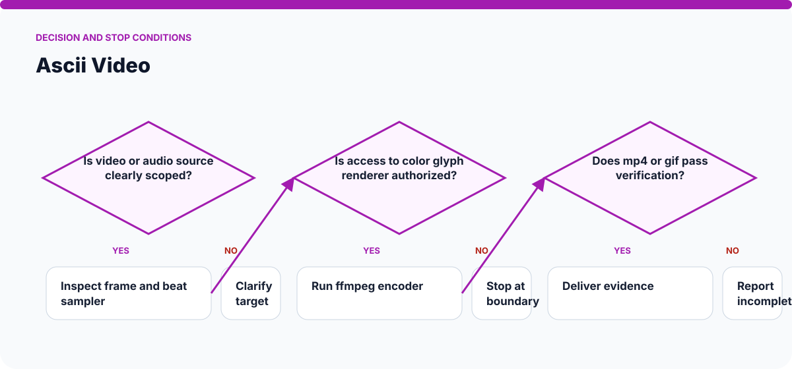

# How Ascii Video Works

The visuals on this page are static SVGs, so they render directly on GitHub on phones and desktop browsers. Each one is generated from a model specific to this skill.

## System architecture

### Components

- **1. Video or audio source:** participates in inspect duration resolution and audio.
- **2. Frame and beat sampler:** participates in choose frame rate width and glyph palette.
- **3. Color glyph renderer:** participates in render each frame as colored characters.
- **4. FFmpeg encoder:** participates in synchronize frames with source timing.
- **5. MP4 or GIF:** participates in encode mp4 or gif with ffmpeg.

## Actor and data sequence

### 1. Inspect duration resolution and audio

**Primary surface:** `Video or audio source`

Record the concrete input, the operation performed, and the evidence produced at this stage. Continue only when the output is sufficient for the next stage; otherwise preserve the blocker and stop.
### 2. Choose frame rate width and glyph palette

**Primary surface:** `Frame and beat sampler`

Record the concrete input, the operation performed, and the evidence produced at this stage. Continue only when the output is sufficient for the next stage; otherwise preserve the blocker and stop.
### 3. Render each frame as colored characters

**Primary surface:** `Color glyph renderer`

Record the concrete input, the operation performed, and the evidence produced at this stage. Continue only when the output is sufficient for the next stage; otherwise preserve the blocker and stop.
### 4. Synchronize frames with source timing

**Primary surface:** `FFmpeg encoder`

Record the concrete input, the operation performed, and the evidence produced at this stage. Continue only when the output is sufficient for the next stage; otherwise preserve the blocker and stop.
### 5. Encode MP4 or GIF with FFmpeg

**Primary surface:** `MP4 or GIF`

Record the concrete input, the operation performed, and the evidence produced at this stage. Continue only when the output is sufficient for the next stage; otherwise preserve the blocker and stop.
### 6. Inspect motion readability and file size

**Primary surface:** `Video or audio source`

Record the concrete input, the operation performed, and the evidence produced at this stage. Continue only when the output is sufficient for the next stage; otherwise preserve the blocker and stop.

## Example output shape

The example is a visual contract: a real run may look different, but it should expose comparable state, provenance, and verification information. It is not presented as evidence of a live external action.

## Decision and stop conditions

The workflow stops when the target is ambiguous, the relevant surface is unavailable or unauthorized, or the final artifact cannot be checked. A logged-in session or successful tool call is not by itself proof that the requested outcome is complete.

## Verification checklist

- Confirm every component shown in the system map exists in the target environment.
- Trace the actor sequence using actual tool output or artifact state.
- Compare the result with the example-output information contract.
- Re-read or reopen the final artifact instead of trusting an attempt message.
- Report omitted stages, unsupported capabilities, and remaining human decisions.
